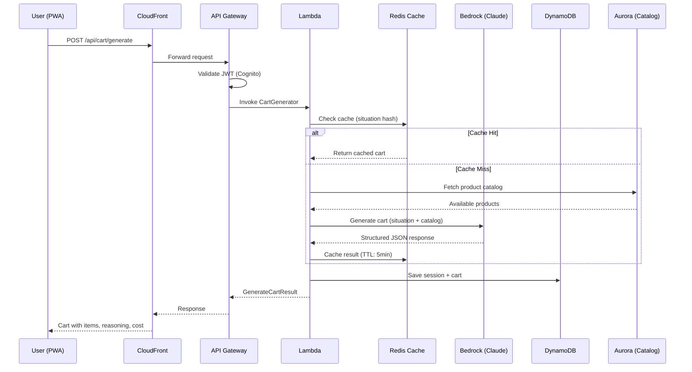

# UrgentCart — Production Architecture

## Overview

UrgentCart is a situation-aware instant delivery platform that uses AI to understand user contexts and generate optimized shopping carts. This document describes the production-ready architecture designed for scale, resilience, and cost efficiency on AWS.

## System Architecture Diagram

```mermaid
graph TB
    subgraph "Client Layer"
        PWA[Mobile PWA / Browser]
        CF[CloudFront CDN]
    end

    subgraph "Compute Layer"
        APIGW[API Gateway<br/>REST + WebSocket]
        LAMBDA[Lambda Functions<br/>Business Logic]
        EDGE[Lambda@Edge<br/>SSR / Next.js]
    end

    subgraph "AI/ML Layer"
        BEDROCK[Amazon Bedrock<br/>Claude 3 Sonnet]
        CACHE[ElastiCache Redis<br/>Response Cache]
        PROMPTS[Prompt Templates<br/>S3 Bucket]
    end

    subgraph "Data Layer"
        DDB[DynamoDB<br/>Users / Orders / Sessions]
        AURORA[Aurora PostgreSQL<br/>Product Catalog]
        S3[S3<br/>Static Assets / Images]
    end

    subgraph "Event Layer"
        EB[EventBridge<br/>Event Router]
        SQS[SQS<br/>Order Queue]
        SNS[SNS<br/>Notifications]
    end

    subgraph "Auth & Security"
        COGNITO[Cognito<br/>User Auth]
        WAF[WAF<br/>Request Filtering]
        SM[Secrets Manager]
    end

    subgraph "Observability"
        CW[CloudWatch<br/>Logs & Metrics]
        XRAY[X-Ray<br/>Tracing]
    end

    PWA --> CF
    CF --> WAF
    WAF --> APIGW
    CF --> EDGE
    EDGE --> S3

    APIGW --> COGNITO
    APIGW --> LAMBDA

    LAMBDA --> BEDROCK
    LAMBDA --> CACHE
    BEDROCK --> PROMPTS

    LAMBDA --> DDB
    LAMBDA --> AURORA
    LAMBDA --> EB

    EB --> SQS
    EB --> SNS
    SQS --> LAMBDA

    LAMBDA --> CW
    LAMBDA --> XRAY
```

## Request Flow: Situation → Cart



## Components

### Frontend Layer
- **CloudFront CDN** for static assets with edge caching (TTL: 24h for assets, 5min for API)
- **Next.js on Lambda@Edge** for server-side rendering and API routes
- **Mobile-first PWA** with offline support via Service Worker
- **Zustand** for client-side state management (cart, conversation, orders)

### API Layer
- **API Gateway** (REST for CRUD, WebSocket for real-time cart updates)
- **Lambda functions** for business logic (cart generation, order processing, user management)
- **Request validation** via API Gateway request models and Lambda input schemas
- **Rate limiting** at API Gateway level (100 req/min per user) + Redis-based sliding window

### AI/ML Layer
- **Amazon Bedrock** (Claude 3 Sonnet) for situation understanding and cart generation
- **Prompt engineering** with product catalog context injected per-request
- **Response caching** in ElastiCache Redis (situation hash → cart, TTL: 5 minutes)
- **Context persistence** in DynamoDB for multi-turn conversations
- **Fallback strategy**: Mock/rule-based cart generation if Bedrock is unavailable

### Data Layer
- **DynamoDB** for user profiles, orders, sessions (single-digit ms latency)
- **Aurora PostgreSQL** for product catalog (full-text search, complex queries)
- **ElastiCache Redis** for caching, rate limiting, real-time session data
- **S3** for static assets, product images, prompt templates

### Event-Driven Architecture
- **EventBridge** for async event routing (order placed, cart generated, user action)
- **SQS** for order processing queue (FIFO, deduplication)
- **Lambda consumers** for background tasks (analytics, notifications, inventory sync)

### Authentication
- **Amazon Cognito** for user auth
- **Phone OTP** + Social login (Google, Apple)
- **JWT token-based** session management with refresh token rotation
- Guest checkout with session-based cart persistence

### Monitoring & Observability
- **CloudWatch** for logs, metrics, custom alarms (error rate, latency P95/P99)
- **X-Ray** for distributed tracing across Lambda → Bedrock → DynamoDB
- **Custom dashboards** for business metrics (carts/hour, conversion rate, AI accuracy)

## Scalability Strategy

| Component | Strategy |
|-----------|----------|
| Compute | Lambda auto-scaling (1000 concurrent default, can increase) |
| Database | DynamoDB on-demand + Aurora read replicas |
| Cache | ElastiCache cluster mode (horizontal sharding) |
| CDN | CloudFront 400+ edge locations globally |
| AI | Bedrock provisioned throughput for predictable baseline |

- Auto-scaling Lambda + DynamoDB on-demand handles traffic spikes
- CloudFront edge caching for static + API responses reduces origin load
- Read replicas for Aurora serve catalog search queries
- ElastiCache cluster mode for hot data and session management

## Cost Optimization

| Service | Pricing Model | Optimization |
|---------|--------------|--------------|
| Lambda | Pay-per-request ($0.20/1M) | < $50/month at 10K DAU |
| DynamoDB | On-demand ($1.25/1M writes) | TTL auto-deletes old sessions |
| Bedrock | Pay-per-token (~$0.003/1K) | Cache reduces calls by 60% |
| CloudFront | $0.085/GB transfer | Compression + cache reduces egress |
| Redis | Node-based ($0.017/hr t4g.micro) | Single node for dev, cluster for prod |

**Estimated monthly cost at 10K DAU**: ~$200-400/month

## Security

- **WAF** on CloudFront + API Gateway (SQL injection, XSS, bot mitigation)
- **Cognito + IAM** for fine-grained access control
- **Secrets Manager** for API keys, DB credentials (auto-rotation)
- **VPC** for database isolation (Aurora + Redis in private subnets)
- **PCI-DSS compliance** for payment processing (via Razorpay/Stripe tokenization)
- **Data encryption** at rest (KMS) and in transit (TLS 1.3)

## Replenishment Engine

The predictive replenishment system analyzes user purchase patterns:

- **EventBridge scheduled rules** trigger analysis daily at low-traffic hours
- **Lambda functions** analyze purchase patterns (frequency, quantities, seasonal trends)
- **DynamoDB TTL** for prediction expiry (auto-cleanup of stale predictions)
- **SNS** for push notifications ("Time to restock your study fuel?")
- **ML model** (SageMaker endpoint) for sophisticated pattern recognition (Phase 2)

## Reorder System

- **DynamoDB order history table** with GSI on userId + date for fast lookups
- **Real-time inventory check** via Lambda querying Aurora catalog
- **Substitute recommendation** via Bedrock when items are out of stock
- **One-tap reorder** reconstructs cart from historical order with availability validation
- **Price change detection** alerts users if items have changed price since last order
