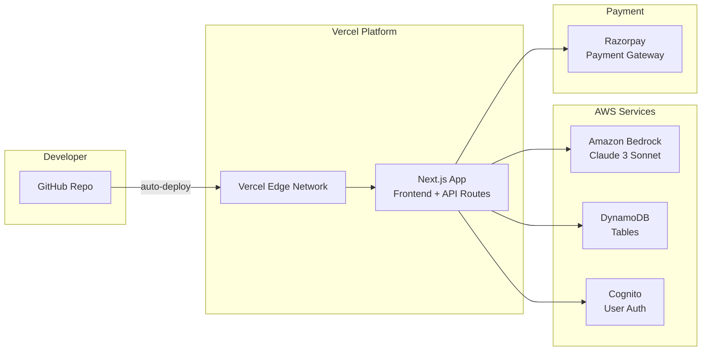
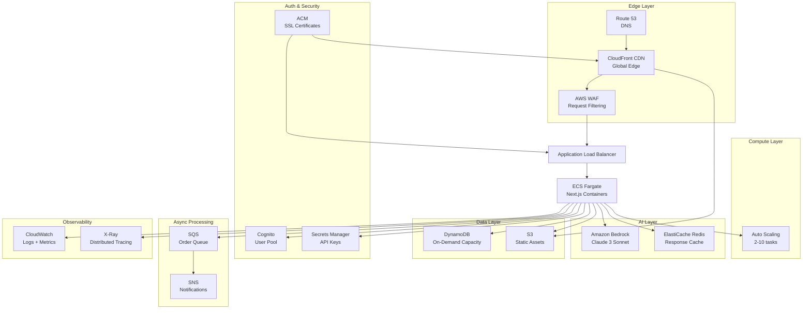

# UrgentCart — Deployment Guide

Complete production deployment guide covering both hackathon (fast) and production (scalable) deployment paths.

## Table of Contents

- [1. Deployment Options Overview](#1-deployment-options-overview)
- [2. Infrastructure Architecture](#2-infrastructure-architecture)
- [3. Environment Variable Strategy](#3-environment-variable-strategy)
- [4. Deployment Steps](#4-deployment-steps)
- [5. CI/CD Workflow](#5-cicd-workflow)
- [6. DynamoDB Table Setup](#6-dynamodb-table-setup)
- [7. Cognito Setup](#7-cognito-setup)
- [8. Monitoring Strategy](#8-monitoring-strategy)
- [9. Logging Strategy](#9-logging-strategy)
- [10. Production Checklist](#10-production-checklist)
- [11. Cost Estimation](#11-cost-estimation)
- [12. Scaling Considerations](#12-scaling-considerations)

---

## 1. Deployment Options Overview

| Criteria | Option A: Hackathon | Option B: Production AWS |
|----------|-------------------|--------------------------|
| Time to deploy | ~15 minutes | ~2-3 hours |
| Cost | Free–$20/month | ~$400-500/month (10K DAU) |
| Scalability | Limited (hobby tier) | Auto-scaling, enterprise-grade |
| Best for | Demos, hackathons, MVPs | Production traffic, real users |
| CI/CD | Auto-deploy on push | Full GitHub Actions pipeline |

### Option A: Hackathon Deployment (Fastest — 15 minutes)

- **Vercel** deployment (zero-config Next.js hosting)
- Environment variables configured via Vercel dashboard
- Free tier sufficient for demo traffic
- Steps: `git push` → auto-deploy
- Preview deployments on every PR
- Built-in CDN and edge functions

### Option B: Production AWS Deployment (Scalable)

- **AWS ECS Fargate** for containerized Next.js
- **CloudFront CDN** for global edge caching
- Full AWS service integration (DynamoDB, Cognito, Bedrock)
- Infrastructure-as-code ready (Terraform/CDK)
- Auto-scaling, monitoring, alerting

---

## 2. Infrastructure Architecture

### Hackathon Architecture



### Production Architecture



---

## 3. Environment Variable Strategy

### Categories

#### Public Variables (Client-side safe — `NEXT_PUBLIC_*`)

| Variable | Description | Example |
|----------|-------------|---------|
| `NEXT_PUBLIC_AI_PROVIDER` | AI backend to use | `mock` or `bedrock` |
| `NEXT_PUBLIC_RAZORPAY_KEY_ID` | Razorpay public key for checkout | `rzp_live_xxxxxxxxxx` |

#### Server-Only Variables (Never exposed to client)

| Variable | Description | Example |
|----------|-------------|---------|
| `AWS_ACCESS_KEY_ID` | AWS IAM access key | `AKIA...` |
| `AWS_SECRET_ACCESS_KEY` | AWS IAM secret key | `wJalr...` |
| `RAZORPAY_KEY_ID` | Razorpay API key (server) | `rzp_live_xxxxxxxxxx` |
| `RAZORPAY_KEY_SECRET` | Razorpay API secret | `xxxxxxxxxxxxxxxxxx` |
| `RAZORPAY_WEBHOOK_SECRET` | Webhook signature validation | `whsec_xxxxxxxxxx` |
| `COGNITO_USER_POOL_ID` | Cognito pool identifier | `us-east-1_xxxxxxxxx` |
| `COGNITO_CLIENT_ID` | Cognito app client ID | `xxxxxxxxxxxxxxxxxxxxxxxxxx` |

#### Infrastructure Variables

| Variable | Description | Example |
|----------|-------------|---------|
| `AWS_REGION` | AWS region for all services | `us-east-1` |
| `COGNITO_REGION` | Cognito region (defaults to AWS_REGION) | `us-east-1` |
| `DYNAMODB_ENDPOINT` | DynamoDB endpoint (local dev only) | `http://localhost:8000` |
| `DYNAMODB_TABLE_PREFIX` | Prefix for DynamoDB tables | `urgentcart-prod-` |
| `USE_DYNAMODB` | Enable DynamoDB (false = in-memory) | `true` |
| `AUTH_MODE` | Authentication mode | `local` or `cognito` |
| `PAYMENT_MODE` | Payment provider mode | `local` or `razorpay` |
| `BEDROCK_MODEL_ID` | Override Bedrock model | `anthropic.claude-3-sonnet-20240229-v1:0` |

### Secrets Management

| Environment | Strategy |
|-------------|----------|
| Local dev | `.env.local` (gitignored) |
| Hackathon (Vercel) | Vercel Environment Variables (encrypted at rest) |
| Production (AWS) | AWS Secrets Manager (auto-rotation capable) |

**Rules:**
- Never commit `.env.local` or any file containing secrets to git
- Use separate secrets per environment (dev/staging/prod)
- Rotate production keys every 90 days
- Use IAM roles (not access keys) when running on AWS compute

---

## 4. Deployment Steps

### Option A: Vercel (Hackathon — 15 minutes)

#### Prerequisites

- Node.js 18+ installed
- Git repository on GitHub
- Vercel account (free tier: https://vercel.com)
- AWS account with Bedrock access (optional for mock mode)

#### Step 1: Install Vercel CLI

```bash
npm install -g vercel
```

#### Step 2: Connect Repository

```bash
# From project root
vercel link
```

Select your GitHub repository when prompted.

#### Step 3: Set Environment Variables

```bash
# Public variables
vercel env add NEXT_PUBLIC_AI_PROVIDER production
# Enter: bedrock (or "mock" for no AWS)

vercel env add NEXT_PUBLIC_RAZORPAY_KEY_ID production
# Enter: rzp_live_your_key_id

# Server secrets
vercel env add AWS_REGION production
# Enter: us-east-1

vercel env add AWS_ACCESS_KEY_ID production
# Enter: your-access-key

vercel env add AWS_SECRET_ACCESS_KEY production
# Enter: your-secret-key

vercel env add USE_DYNAMODB production
# Enter: true

vercel env add DYNAMODB_TABLE_PREFIX production
# Enter: urgentcart-prod-

vercel env add AUTH_MODE production
# Enter: cognito

vercel env add COGNITO_USER_POOL_ID production
# Enter: us-east-1_xxxxxxxxx

vercel env add COGNITO_CLIENT_ID production
# Enter: your-client-id

vercel env add PAYMENT_MODE production
# Enter: razorpay

vercel env add RAZORPAY_KEY_ID production
# Enter: rzp_live_your_key_id

vercel env add RAZORPAY_KEY_SECRET production
# Enter: your-secret

vercel env add RAZORPAY_WEBHOOK_SECRET production
# Enter: whsec_your_webhook_secret
```

Or set all variables at once in the Vercel Dashboard → Project → Settings → Environment Variables.

#### Step 4: Deploy

```bash
# Deploy to production
vercel --prod

# Or just push to main (auto-deploys if connected)
git push origin main
```

#### Step 5: Verify Deployment

```bash
# Check the deployment URL
curl https://your-app.vercel.app/api/products

# Expected: 200 OK with product list JSON
```

#### Step 6: Custom Domain (Optional)

```bash
vercel domains add yourdomain.com
```

Then update DNS: Add CNAME record pointing to `cname.vercel-dns.com`.

#### Step 7: Configure Razorpay Webhook

In Razorpay Dashboard → Settings → Webhooks:
- URL: `https://your-app.vercel.app/api/payments/webhook`
- Events: `payment.authorized`, `payment.captured`, `payment.failed`

---

### Option B: AWS Production Deployment

#### Prerequisites

- AWS CLI v2 configured (`aws configure`)
- Docker installed
- Node.js 18+
- Domain name (optional but recommended)

#### Step 1: Create ECR Repository

```bash
# Create container registry
aws ecr create-repository \
  --repository-name urgentcart \
  --region us-east-1 \
  --image-scanning-configuration scanOnPush=true \
  --encryption-configuration encryptionType=AES256

# Get login token
aws ecr get-login-password --region us-east-1 | \
  docker login --username AWS --password-stdin \
  $(aws sts get-caller-identity --query Account --output text).dkr.ecr.us-east-1.amazonaws.com
```

#### Step 2: Create Dockerfile

Create `Dockerfile` in project root:

```dockerfile
FROM node:18-alpine AS base

# Install dependencies
FROM base AS deps
WORKDIR /app
COPY package.json package-lock.json ./
RUN npm ci --only=production

# Build application
FROM base AS builder
WORKDIR /app
COPY --from=deps /app/node_modules ./node_modules
COPY . .
RUN npm run build

# Production runner
FROM base AS runner
WORKDIR /app

ENV NODE_ENV=production
ENV NEXT_TELEMETRY_DISABLED=1

RUN addgroup --system --gid 1001 nodejs
RUN adduser --system --uid 1001 nextjs

COPY --from=builder /app/public ./public
COPY --from=builder --chown=nextjs:nodejs /app/.next/standalone ./
COPY --from=builder --chown=nextjs:nodejs /app/.next/static ./.next/static

USER nextjs

EXPOSE 3000
ENV PORT=3000
ENV HOSTNAME="0.0.0.0"

CMD ["node", "server.js"]
```

#### Step 3: Build and Push Image

```bash
# Build Docker image
docker build -t urgentcart .

# Tag for ECR
ACCOUNT_ID=$(aws sts get-caller-identity --query Account --output text)
docker tag urgentcart:latest ${ACCOUNT_ID}.dkr.ecr.us-east-1.amazonaws.com/urgentcart:latest

# Push to ECR
docker push ${ACCOUNT_ID}.dkr.ecr.us-east-1.amazonaws.com/urgentcart:latest
```

#### Step 4: Create DynamoDB Tables

See [Section 6: DynamoDB Table Setup](#6-dynamodb-table-setup) for complete commands.

#### Step 5: Set Up Cognito

See [Section 7: Cognito Setup](#7-cognito-setup) for complete commands.

#### Step 6: Request Bedrock Model Access

```bash
# Request access to Claude 3 Sonnet (manual approval in console)
aws bedrock put-model-access \
  --region us-east-1 \
  --model-id anthropic.claude-3-sonnet-20240229-v1:0

# Verify access
aws bedrock list-foundation-models \
  --region us-east-1 \
  --query "modelSummaries[?modelId=='anthropic.claude-3-sonnet-20240229-v1:0'].modelId" \
  --output text
```

> **Note:** Bedrock model access must be requested via the AWS Console at: https://console.aws.amazon.com/bedrock/home#/modelaccess

#### Step 7: Store Secrets in Secrets Manager

```bash
# Create secrets
aws secretsmanager create-secret \
  --name urgentcart/prod/razorpay \
  --description "Razorpay API credentials" \
  --secret-string '{
    "RAZORPAY_KEY_ID": "rzp_live_your_key_id",
    "RAZORPAY_KEY_SECRET": "your_key_secret",
    "RAZORPAY_WEBHOOK_SECRET": "whsec_your_webhook_secret"
  }'

aws secretsmanager create-secret \
  --name urgentcart/prod/cognito \
  --description "Cognito configuration" \
  --secret-string '{
    "COGNITO_USER_POOL_ID": "us-east-1_xxxxxxxxx",
    "COGNITO_CLIENT_ID": "your_client_id"
  }'
```

#### Step 8: Create ECS Cluster and Service

```bash
# Create ECS cluster
aws ecs create-cluster \
  --cluster-name urgentcart-prod \
  --capacity-providers FARGATE FARGATE_SPOT \
  --default-capacity-provider-strategy \
    capacityProvider=FARGATE,weight=1,base=1 \
    capacityProvider=FARGATE_SPOT,weight=3

# Create CloudWatch log group
aws logs create-log-group \
  --log-group-name /ecs/urgentcart-prod

# Create task execution role (save this as trust-policy.json first)
# trust-policy.json:
# {
#   "Version": "2012-10-17",
#   "Statement": [{
#     "Effect": "Allow",
#     "Principal": {"Service": "ecs-tasks.amazonaws.com"},
#     "Action": "sts:AssumeRole"
#   }]
# }

aws iam create-role \
  --role-name urgentcart-ecs-task-execution \
  --assume-role-policy-document file://trust-policy.json

aws iam attach-role-policy \
  --role-name urgentcart-ecs-task-execution \
  --policy-arn arn:aws:iam::aws:policy/service-role/AmazonECSTaskExecutionRolePolicy

aws iam attach-role-policy \
  --role-name urgentcart-ecs-task-execution \
  --policy-arn arn:aws:iam::aws:policy/SecretsManagerReadWrite

# Create task role (for app permissions)
aws iam create-role \
  --role-name urgentcart-ecs-task \
  --assume-role-policy-document file://trust-policy.json

# Attach policies for DynamoDB, Bedrock, Cognito access
aws iam put-role-policy \
  --role-name urgentcart-ecs-task \
  --policy-name urgentcart-services \
  --policy-document '{
    "Version": "2012-10-17",
    "Statement": [
      {
        "Effect": "Allow",
        "Action": [
          "dynamodb:GetItem",
          "dynamodb:PutItem",
          "dynamodb:UpdateItem",
          "dynamodb:DeleteItem",
          "dynamodb:Query",
          "dynamodb:Scan"
        ],
        "Resource": "arn:aws:dynamodb:us-east-1:*:table/urgentcart-prod-*"
      },
      {
        "Effect": "Allow",
        "Action": [
          "bedrock:InvokeModel",
          "bedrock:InvokeModelWithResponseStream"
        ],
        "Resource": "arn:aws:bedrock:us-east-1::foundation-model/anthropic.claude-3-sonnet-20240229-v1:0"
      },
      {
        "Effect": "Allow",
        "Action": [
          "cognito-idp:AdminGetUser",
          "cognito-idp:AdminInitiateAuth"
        ],
        "Resource": "arn:aws:cognito-idp:us-east-1:*:userpool/*"
      },
      {
        "Effect": "Allow",
        "Action": [
          "secretsmanager:GetSecretValue"
        ],
        "Resource": "arn:aws:secretsmanager:us-east-1:*:secret:urgentcart/prod/*"
      }
    ]
  }'
```

#### Step 9: Register Task Definition

```bash
ACCOUNT_ID=$(aws sts get-caller-identity --query Account --output text)

aws ecs register-task-definition \
  --family urgentcart-prod \
  --network-mode awsvpc \
  --requires-compatibilities FARGATE \
  --cpu "512" \
  --memory "1024" \
  --execution-role-arn arn:aws:iam::${ACCOUNT_ID}:role/urgentcart-ecs-task-execution \
  --task-role-arn arn:aws:iam::${ACCOUNT_ID}:role/urgentcart-ecs-task \
  --container-definitions "[
    {
      \"name\": \"urgentcart\",
      \"image\": \"${ACCOUNT_ID}.dkr.ecr.us-east-1.amazonaws.com/urgentcart:latest\",
      \"portMappings\": [{\"containerPort\": 3000, \"protocol\": \"tcp\"}],
      \"environment\": [
        {\"name\": \"NODE_ENV\", \"value\": \"production\"},
        {\"name\": \"AWS_REGION\", \"value\": \"us-east-1\"},
        {\"name\": \"NEXT_PUBLIC_AI_PROVIDER\", \"value\": \"bedrock\"},
        {\"name\": \"USE_DYNAMODB\", \"value\": \"true\"},
        {\"name\": \"DYNAMODB_TABLE_PREFIX\", \"value\": \"urgentcart-prod-\"},
        {\"name\": \"AUTH_MODE\", \"value\": \"cognito\"},
        {\"name\": \"PAYMENT_MODE\", \"value\": \"razorpay\"}
      ],
      \"secrets\": [
        {\"name\": \"RAZORPAY_KEY_ID\", \"valueFrom\": \"arn:aws:secretsmanager:us-east-1:${ACCOUNT_ID}:secret:urgentcart/prod/razorpay:RAZORPAY_KEY_ID::\"},
        {\"name\": \"RAZORPAY_KEY_SECRET\", \"valueFrom\": \"arn:aws:secretsmanager:us-east-1:${ACCOUNT_ID}:secret:urgentcart/prod/razorpay:RAZORPAY_KEY_SECRET::\"},
        {\"name\": \"RAZORPAY_WEBHOOK_SECRET\", \"valueFrom\": \"arn:aws:secretsmanager:us-east-1:${ACCOUNT_ID}:secret:urgentcart/prod/razorpay:RAZORPAY_WEBHOOK_SECRET::\"},
        {\"name\": \"COGNITO_USER_POOL_ID\", \"valueFrom\": \"arn:aws:secretsmanager:us-east-1:${ACCOUNT_ID}:secret:urgentcart/prod/cognito:COGNITO_USER_POOL_ID::\"},
        {\"name\": \"COGNITO_CLIENT_ID\", \"valueFrom\": \"arn:aws:secretsmanager:us-east-1:${ACCOUNT_ID}:secret:urgentcart/prod/cognito:COGNITO_CLIENT_ID::\"}
      ],
      \"logConfiguration\": {
        \"logDriver\": \"awslogs\",
        \"options\": {
          \"awslogs-group\": \"/ecs/urgentcart-prod\",
          \"awslogs-region\": \"us-east-1\",
          \"awslogs-stream-prefix\": \"ecs\"
        }
      },
      \"healthCheck\": {
        \"command\": [\"CMD-SHELL\", \"curl -f http://localhost:3000/api/products || exit 1\"],
        \"interval\": 30,
        \"timeout\": 5,
        \"retries\": 3,
        \"startPeriod\": 60
      }
    }
  ]"
```

#### Step 10: Create ALB and ECS Service

```bash
# Create VPC resources (use default VPC for simplicity)
VPC_ID=$(aws ec2 describe-vpcs --filters "Name=isDefault,Values=true" --query "Vpcs[0].VpcId" --output text)
SUBNET_IDS=$(aws ec2 describe-subnets --filters "Name=vpc-id,Values=${VPC_ID}" --query "Subnets[*].SubnetId" --output text | tr '\t' ',')

# Create security group for ALB
ALB_SG=$(aws ec2 create-security-group \
  --group-name urgentcart-alb-sg \
  --description "ALB security group" \
  --vpc-id ${VPC_ID} \
  --query "GroupId" --output text)

aws ec2 authorize-security-group-ingress \
  --group-id ${ALB_SG} \
  --protocol tcp --port 443 --cidr 0.0.0.0/0

aws ec2 authorize-security-group-ingress \
  --group-id ${ALB_SG} \
  --protocol tcp --port 80 --cidr 0.0.0.0/0

# Create security group for ECS tasks
ECS_SG=$(aws ec2 create-security-group \
  --group-name urgentcart-ecs-sg \
  --description "ECS tasks security group" \
  --vpc-id ${VPC_ID} \
  --query "GroupId" --output text)

aws ec2 authorize-security-group-ingress \
  --group-id ${ECS_SG} \
  --protocol tcp --port 3000 --source-group ${ALB_SG}

# Create ALB
ALB_ARN=$(aws elbv2 create-load-balancer \
  --name urgentcart-prod-alb \
  --subnets $(echo ${SUBNET_IDS} | tr ',' ' ') \
  --security-groups ${ALB_SG} \
  --scheme internet-facing \
  --type application \
  --query "LoadBalancers[0].LoadBalancerArn" --output text)

# Create target group
TG_ARN=$(aws elbv2 create-target-group \
  --name urgentcart-prod-tg \
  --protocol HTTP \
  --port 3000 \
  --vpc-id ${VPC_ID} \
  --target-type ip \
  --health-check-path "/api/products" \
  --health-check-interval-seconds 30 \
  --healthy-threshold-count 2 \
  --unhealthy-threshold-count 3 \
  --query "TargetGroups[0].TargetGroupArn" --output text)

# Create HTTPS listener (requires ACM certificate - see Step 11)
# For initial setup without SSL, use HTTP:
aws elbv2 create-listener \
  --load-balancer-arn ${ALB_ARN} \
  --protocol HTTP \
  --port 80 \
  --default-actions Type=forward,TargetGroupArn=${TG_ARN}

# Create ECS service
aws ecs create-service \
  --cluster urgentcart-prod \
  --service-name urgentcart-web \
  --task-definition urgentcart-prod \
  --desired-count 2 \
  --launch-type FARGATE \
  --network-configuration "awsvpcConfiguration={subnets=[$(echo ${SUBNET_IDS} | tr ',' ',')],securityGroups=[${ECS_SG}],assignPublicIp=ENABLED}" \
  --load-balancers "targetGroupArn=${TG_ARN},containerName=urgentcart,containerPort=3000" \
  --deployment-configuration "maximumPercent=200,minimumHealthyPercent=100" \
  --enable-execute-command
```

#### Step 11: SSL Certificate (ACM)

```bash
# Request certificate
CERT_ARN=$(aws acm request-certificate \
  --domain-name urgentcart.yourdomain.com \
  --validation-method DNS \
  --query "CertificateArn" --output text)

# Get DNS validation record
aws acm describe-certificate \
  --certificate-arn ${CERT_ARN} \
  --query "Certificate.DomainValidationOptions[0].ResourceRecord"

# After DNS validation completes, add HTTPS listener
aws elbv2 create-listener \
  --load-balancer-arn ${ALB_ARN} \
  --protocol HTTPS \
  --port 443 \
  --ssl-policy ELBSecurityPolicy-TLS13-1-2-2021-06 \
  --certificates CertificateArn=${CERT_ARN} \
  --default-actions Type=forward,TargetGroupArn=${TG_ARN}

# Redirect HTTP to HTTPS
aws elbv2 modify-listener \
  --listener-arn $(aws elbv2 describe-listeners --load-balancer-arn ${ALB_ARN} --query "Listeners[?Port==\`80\`].ListenerArn" --output text) \
  --default-actions '[{"Type":"redirect","RedirectConfig":{"Protocol":"HTTPS","Port":"443","StatusCode":"HTTP_301"}}]'
```

#### Step 12: CloudFront Distribution

```bash
# Create CloudFront distribution
ALB_DNS=$(aws elbv2 describe-load-balancers \
  --load-balancer-arns ${ALB_ARN} \
  --query "LoadBalancers[0].DNSName" --output text)

aws cloudfront create-distribution \
  --distribution-config '{
    "CallerReference": "urgentcart-prod-'$(date +%s)'",
    "Origins": {
      "Quantity": 1,
      "Items": [{
        "Id": "urgentcart-alb",
        "DomainName": "'${ALB_DNS}'",
        "CustomOriginConfig": {
          "HTTPPort": 80,
          "HTTPSPort": 443,
          "OriginProtocolPolicy": "https-only",
          "OriginSslProtocols": {"Quantity": 1, "Items": ["TLSv1.2"]}
        }
      }]
    },
    "DefaultCacheBehavior": {
      "TargetOriginId": "urgentcart-alb",
      "ViewerProtocolPolicy": "redirect-to-https",
      "AllowedMethods": {"Quantity": 7, "Items": ["GET","HEAD","OPTIONS","PUT","POST","PATCH","DELETE"]},
      "CachedMethods": {"Quantity": 2, "Items": ["GET","HEAD"]},
      "ForwardedValues": {
        "QueryString": true,
        "Cookies": {"Forward": "all"},
        "Headers": {"Quantity": 4, "Items": ["Authorization","Host","Accept","Content-Type"]}
      },
      "MinTTL": 0,
      "DefaultTTL": 0,
      "MaxTTL": 31536000,
      "Compress": true
    },
    "Enabled": true,
    "Comment": "UrgentCart Production",
    "PriceClass": "PriceClass_200",
    "ViewerCertificate": {
      "CloudFrontDefaultCertificate": true
    }
  }'
```

#### Step 13: Route 53 Domain Configuration

```bash
# Get CloudFront distribution domain
CF_DOMAIN=$(aws cloudfront list-distributions \
  --query "DistributionList.Items[?Comment=='UrgentCart Production'].DomainName" \
  --output text)

# Create hosted zone (if not exists)
ZONE_ID=$(aws route53 list-hosted-zones \
  --query "HostedZones[?Name=='yourdomain.com.'].Id" \
  --output text | cut -d'/' -f3)

# Create A record alias to CloudFront
aws route53 change-resource-record-sets \
  --hosted-zone-id ${ZONE_ID} \
  --change-batch '{
    "Changes": [{
      "Action": "UPSERT",
      "ResourceRecordSet": {
        "Name": "urgentcart.yourdomain.com",
        "Type": "A",
        "AliasTarget": {
          "HostedZoneId": "Z2FDTNDATAQYW2",
          "DNSName": "'${CF_DOMAIN}'",
          "EvaluateTargetHealth": false
        }
      }
    }]
  }'
```

---

## 5. CI/CD Workflow

### GitHub Actions (Full Pipeline)

The complete workflow is at `.github/workflows/deploy.yml`. It handles:

1. **Lint + Type Check** — Catches errors early
2. **Build** — Ensures the app compiles
3. **Deploy to Staging** — On pull requests (preview)
4. **Deploy to Production** — On merge to `main`

See the workflow file for full implementation.

### Vercel CI/CD (Simpler Alternative)

For hackathon deployments, Vercel provides built-in CI/CD:

- **Production deploy**: Auto-triggers on push to `main`
- **Preview deploy**: Auto-triggers on every PR
- **Instant rollback**: One-click in Vercel dashboard
- **No configuration needed**: Works with `git push`

To enable:
1. Connect GitHub repo in Vercel dashboard
2. Vercel auto-detects Next.js framework
3. Every push triggers a build

---

## 6. DynamoDB Table Setup

### Create All Tables

```bash
# Set variables
REGION="us-east-1"
PREFIX="urgentcart-prod-"

# Table: users
aws dynamodb create-table \
  --table-name ${PREFIX}users \
  --attribute-definitions \
    AttributeName=PK,AttributeType=S \
    AttributeName=SK,AttributeType=S \
  --key-schema \
    AttributeName=PK,KeyType=HASH \
    AttributeName=SK,KeyType=RANGE \
  --billing-mode PAY_PER_REQUEST \
  --region ${REGION} \
  --tags Key=Project,Value=UrgentCart Key=Environment,Value=production

# Table: orders (with GSI for date-sorted queries)
aws dynamodb create-table \
  --table-name ${PREFIX}orders \
  --attribute-definitions \
    AttributeName=PK,AttributeType=S \
    AttributeName=SK,AttributeType=S \
    AttributeName=createdAt,AttributeType=S \
  --key-schema \
    AttributeName=PK,KeyType=HASH \
    AttributeName=SK,KeyType=RANGE \
  --global-secondary-indexes '[
    {
      "IndexName": "OrdersByDate",
      "KeySchema": [
        {"AttributeName": "PK", "KeyType": "HASH"},
        {"AttributeName": "createdAt", "KeyType": "RANGE"}
      ],
      "Projection": {"ProjectionType": "ALL"}
    }
  ]' \
  --billing-mode PAY_PER_REQUEST \
  --region ${REGION} \
  --tags Key=Project,Value=UrgentCart Key=Environment,Value=production

# Table: conversations (with TTL)
aws dynamodb create-table \
  --table-name ${PREFIX}conversations \
  --attribute-definitions \
    AttributeName=PK,AttributeType=S \
    AttributeName=SK,AttributeType=S \
  --key-schema \
    AttributeName=PK,KeyType=HASH \
    AttributeName=SK,KeyType=RANGE \
  --billing-mode PAY_PER_REQUEST \
  --region ${REGION} \
  --tags Key=Project,Value=UrgentCart Key=Environment,Value=production

# Enable TTL on conversations (auto-expire after 30 days)
aws dynamodb update-time-to-live \
  --table-name ${PREFIX}conversations \
  --time-to-live-specification "Enabled=true,AttributeName=ttl" \
  --region ${REGION}

# Table: saved-carts (with TTL)
aws dynamodb create-table \
  --table-name ${PREFIX}saved-carts \
  --attribute-definitions \
    AttributeName=PK,AttributeType=S \
    AttributeName=SK,AttributeType=S \
  --key-schema \
    AttributeName=PK,KeyType=HASH \
    AttributeName=SK,KeyType=RANGE \
  --billing-mode PAY_PER_REQUEST \
  --region ${REGION} \
  --tags Key=Project,Value=UrgentCart Key=Environment,Value=production

# Enable TTL on saved-carts (auto-expire after 7 days)
aws dynamodb update-time-to-live \
  --table-name ${PREFIX}saved-carts \
  --time-to-live-specification "Enabled=true,AttributeName=ttl" \
  --region ${REGION}

# Table: payments (with GSI for order lookup)
aws dynamodb create-table \
  --table-name ${PREFIX}payments \
  --attribute-definitions \
    AttributeName=PK,AttributeType=S \
    AttributeName=SK,AttributeType=S \
    AttributeName=GSI1PK,AttributeType=S \
    AttributeName=GSI1SK,AttributeType=S \
  --key-schema \
    AttributeName=PK,KeyType=HASH \
    AttributeName=SK,KeyType=RANGE \
  --global-secondary-indexes '[
    {
      "IndexName": "GSI1",
      "KeySchema": [
        {"AttributeName": "GSI1PK", "KeyType": "HASH"},
        {"AttributeName": "GSI1SK", "KeyType": "RANGE"}
      ],
      "Projection": {"ProjectionType": "ALL"}
    }
  ]' \
  --billing-mode PAY_PER_REQUEST \
  --region ${REGION} \
  --tags Key=Project,Value=UrgentCart Key=Environment,Value=production
```

### Verify Tables

```bash
aws dynamodb list-tables --region ${REGION} \
  --query "TableNames[?starts_with(@, '${PREFIX}')]"
```

Expected output:
```json
[
  "urgentcart-prod-conversations",
  "urgentcart-prod-orders",
  "urgentcart-prod-payments",
  "urgentcart-prod-saved-carts",
  "urgentcart-prod-users"
]
```

---

## 7. Cognito Setup

### Create User Pool

```bash
REGION="us-east-1"

# Create user pool
POOL_ID=$(aws cognito-idp create-user-pool \
  --pool-name urgentcart-prod \
  --auto-verified-attributes email phone_number \
  --username-attributes email phone_number \
  --mfa-configuration OFF \
  --policies '{
    "PasswordPolicy": {
      "MinimumLength": 8,
      "RequireUppercase": true,
      "RequireLowercase": true,
      "RequireNumbers": true,
      "RequireSymbols": false,
      "TemporaryPasswordValidityDays": 7
    }
  }' \
  --schema '[
    {"Name": "email", "Required": true, "Mutable": true},
    {"Name": "phone_number", "Required": false, "Mutable": true},
    {"Name": "name", "Required": true, "Mutable": true}
  ]' \
  --account-recovery-setting '{
    "RecoveryMechanisms": [
      {"Priority": 1, "Name": "verified_email"},
      {"Priority": 2, "Name": "verified_phone_number"}
    ]
  }' \
  --region ${REGION} \
  --query "UserPool.Id" --output text)

echo "User Pool ID: ${POOL_ID}"
```

### Create App Client

```bash
# Create app client (no secret - required for SPA/mobile)
CLIENT_ID=$(aws cognito-idp create-user-pool-client \
  --user-pool-id ${POOL_ID} \
  --client-name urgentcart-web \
  --no-generate-secret \
  --explicit-auth-flows \
    ALLOW_USER_SRP_AUTH \
    ALLOW_REFRESH_TOKEN_AUTH \
    ALLOW_USER_PASSWORD_AUTH \
  --supported-identity-providers COGNITO \
  --prevent-user-existence-errors ENABLED \
  --access-token-validity 1 \
  --id-token-validity 1 \
  --refresh-token-validity 30 \
  --token-validity-units '{
    "AccessToken": "hours",
    "IdToken": "hours",
    "RefreshToken": "days"
  }' \
  --region ${REGION} \
  --query "UserPoolClient.ClientId" --output text)

echo "Client ID: ${CLIENT_ID}"
```

### Configure Custom Domain (Optional)

```bash
# Add custom domain
aws cognito-idp create-user-pool-domain \
  --domain urgentcart-prod \
  --user-pool-id ${POOL_ID} \
  --region ${REGION}

# Hosted UI URL will be:
# https://urgentcart-prod.auth.us-east-1.amazoncognito.com
```

### Verify Setup

```bash
# Describe user pool
aws cognito-idp describe-user-pool \
  --user-pool-id ${POOL_ID} \
  --region ${REGION} \
  --query "UserPool.{Id:Id,Name:Name,Status:Status,CreationDate:CreationDate}"

# List app clients
aws cognito-idp list-user-pool-clients \
  --user-pool-id ${POOL_ID} \
  --region ${REGION}
```

### Store Credentials

After creation, update your secrets:

```bash
aws secretsmanager update-secret \
  --secret-id urgentcart/prod/cognito \
  --secret-string "{
    \"COGNITO_USER_POOL_ID\": \"${POOL_ID}\",
    \"COGNITO_CLIENT_ID\": \"${CLIENT_ID}\"
  }"
```

---

## 8. Monitoring Strategy

### Key Metrics to Track

| Category | Metric | Target | Alert Threshold |
|----------|--------|--------|-----------------|
| Latency | API P50 | < 200ms | — |
| Latency | API P95 | < 1s | > 2s |
| Latency | API P99 | < 2s | > 5s |
| Latency | Bedrock response time | < 3s | > 8s |
| Errors | Error rate (5xx) | < 1% | > 5% |
| Errors | Payment failure rate | < 2% | > 10% |
| Business | Cart generation success | > 95% | < 85% |
| Business | Conversion (cart → order) | > 30% | < 15% |
| Business | User session duration | > 3min | — |
| Infra | DynamoDB throttled requests | 0 | > 10/min |
| Infra | ECS CPU utilization | < 70% | > 85% |
| Infra | ECS memory utilization | < 75% | > 90% |

### CloudWatch Alarms

```bash
REGION="us-east-1"

# High error rate alarm
aws cloudwatch put-metric-alarm \
  --alarm-name urgentcart-high-error-rate \
  --alarm-description "API error rate exceeds 5%" \
  --metric-name 5XXError \
  --namespace AWS/ApplicationELB \
  --statistic Sum \
  --period 300 \
  --threshold 5 \
  --comparison-operator GreaterThanThreshold \
  --evaluation-periods 2 \
  --alarm-actions arn:aws:sns:${REGION}:$(aws sts get-caller-identity --query Account --output text):urgentcart-alerts \
  --dimensions Name=LoadBalancer,Value=app/urgentcart-prod-alb/xxxxxxxxxx \
  --region ${REGION}

# High latency alarm (P99 > 5s)
aws cloudwatch put-metric-alarm \
  --alarm-name urgentcart-high-latency \
  --alarm-description "P99 latency exceeds 5 seconds" \
  --metric-name TargetResponseTime \
  --namespace AWS/ApplicationELB \
  --extended-statistic p99 \
  --period 300 \
  --threshold 5 \
  --comparison-operator GreaterThanThreshold \
  --evaluation-periods 2 \
  --alarm-actions arn:aws:sns:${REGION}:$(aws sts get-caller-identity --query Account --output text):urgentcart-alerts \
  --dimensions Name=LoadBalancer,Value=app/urgentcart-prod-alb/xxxxxxxxxx \
  --region ${REGION}

# DynamoDB throttling alarm
aws cloudwatch put-metric-alarm \
  --alarm-name urgentcart-dynamodb-throttle \
  --alarm-description "DynamoDB requests being throttled" \
  --metric-name ThrottledRequests \
  --namespace AWS/DynamoDB \
  --statistic Sum \
  --period 60 \
  --threshold 10 \
  --comparison-operator GreaterThanThreshold \
  --evaluation-periods 3 \
  --alarm-actions arn:aws:sns:${REGION}:$(aws sts get-caller-identity --query Account --output text):urgentcart-alerts \
  --region ${REGION}

# ECS CPU alarm
aws cloudwatch put-metric-alarm \
  --alarm-name urgentcart-ecs-high-cpu \
  --alarm-description "ECS CPU utilization exceeds 85%" \
  --metric-name CPUUtilization \
  --namespace AWS/ECS \
  --statistic Average \
  --period 300 \
  --threshold 85 \
  --comparison-operator GreaterThanThreshold \
  --evaluation-periods 2 \
  --alarm-actions arn:aws:sns:${REGION}:$(aws sts get-caller-identity --query Account --output text):urgentcart-alerts \
  --dimensions Name=ClusterName,Value=urgentcart-prod Name=ServiceName,Value=urgentcart-web \
  --region ${REGION}
```

### Dashboard Layout

Create a CloudWatch dashboard with these panels:

| Row | Panel 1 | Panel 2 | Panel 3 |
|-----|---------|---------|---------|
| 1 | Request Count (line) | Error Rate % (line) | P50/P95/P99 Latency (line) |
| 2 | Bedrock Response Time (line) | Cart Generation Success % (number) | Conversion Rate % (number) |
| 3 | DynamoDB Read/Write (stacked) | ECS CPU/Memory (line) | Active Tasks (number) |
| 4 | Payment Success/Failure (bar) | Throttled Requests (bar) | Cost Estimate (number) |

---

## 9. Logging Strategy

### Structured Logging Format

All application logs follow this JSON structure:

```json
{
  "timestamp": "2024-01-15T10:30:45.123Z",
  "level": "INFO",
  "service": "urgentcart",
  "component": "ai|orders|payments|auth|cart",
  "requestId": "req_a1b2c3d4e5f6",
  "userId": "usr_x7y8z9",
  "traceId": "1-abc123-def456789",
  "message": "Cart generated successfully",
  "duration_ms": 1250,
  "metadata": {
    "situationLabel": "late-night-study",
    "itemCount": 5,
    "totalAmount": 450.00,
    "modelId": "anthropic.claude-3-sonnet-20240229-v1:0"
  }
}
```

### Log Levels

| Level | Usage | Example |
|-------|-------|---------|
| `ERROR` | Unexpected failures requiring attention | Payment verification failed, Bedrock timeout |
| `WARN` | Degraded behavior, non-critical issues | Cache miss, slow query, retry attempt |
| `INFO` | Normal operations, business events | Cart generated, order placed, user signed up |
| `DEBUG` | Detailed debugging (dev/staging only) | Request/response bodies, SQL queries |

### Log Retention Policy

| Tier | Duration | Storage | Purpose |
|------|----------|---------|---------|
| Hot | 7 days | CloudWatch Logs | Real-time debugging, active investigation |
| Warm | 30 days | S3 Standard | Recent incident analysis, trend review |
| Cold | 90 days | S3 Glacier | Compliance, audit trail |

### Log Export Setup

```bash
# Create S3 bucket for log archival
aws s3 mb s3://urgentcart-logs-archive --region us-east-1

# Create lifecycle policy for tiered storage
aws s3api put-bucket-lifecycle-configuration \
  --bucket urgentcart-logs-archive \
  --lifecycle-configuration '{
    "Rules": [
      {
        "ID": "LogRetention",
        "Status": "Enabled",
        "Prefix": "logs/",
        "Transitions": [
          {"Days": 30, "StorageClass": "STANDARD_IA"},
          {"Days": 90, "StorageClass": "GLACIER"}
        ],
        "Expiration": {"Days": 365}
      }
    ]
  }'

# Set CloudWatch log group retention
aws logs put-retention-policy \
  --log-group-name /ecs/urgentcart-prod \
  --retention-in-days 7
```

---

## 10. Production Checklist

### Pre-Deployment

- [ ] All environment variables set and verified
- [ ] DynamoDB tables created with correct schema and GSIs
- [ ] DynamoDB TTL enabled on conversations and saved-carts tables
- [ ] Cognito User Pool created and app client configured
- [ ] Bedrock model access approved (Claude 3 Sonnet)
- [ ] Razorpay webhook URL configured with correct events
- [ ] SSL certificate provisioned and validated (ACM)
- [ ] Domain DNS configured (Route 53 or external DNS)
- [ ] Health check endpoint responding (`/api/products`)
- [ ] Error tracking configured (CloudWatch Logs)
- [ ] Secrets stored in AWS Secrets Manager (not env files)
- [ ] Docker image built and pushed to ECR
- [ ] ECS task definition registered
- [ ] Load balancer and target group created

### Post-Deployment

- [ ] Smoke tests passing (all API endpoints respond)
- [ ] Auth flow working end-to-end (signup → verify → login → refresh)
- [ ] Payment flow working end-to-end (create order → pay → verify → webhook)
- [ ] AI cart generation working (situation → cart with items)
- [ ] Cart modification working (add/remove/substitute items)
- [ ] Order history accessible
- [ ] Monitoring dashboard live and showing data
- [ ] CloudWatch alarms configured and tested
- [ ] Backup strategy confirmed (DynamoDB PITR enabled)
- [ ] Log streaming working to CloudWatch

### Security Checklist

- [ ] No secrets committed to git (check `.gitignore`)
- [ ] CORS configured correctly (allowed origins restricted)
- [ ] Rate limiting enabled (API Gateway or application-level)
- [ ] WAF rules active (SQL injection, XSS, bot protection)
- [ ] Input validation on all API endpoints (Zod schemas)
- [ ] HTTPS enforced (HTTP → HTTPS redirect)
- [ ] API keys rotated from development values
- [ ] IAM roles follow least-privilege principle
- [ ] VPC security groups restrict traffic to necessary ports
- [ ] DynamoDB encryption at rest enabled (default)
- [ ] CloudFront configured with TLS 1.2+ only
- [ ] Razorpay webhook signature validation active

---

## 11. Cost Estimation

### Hackathon / Demo (Free Tier)

| Service | Pricing | Monthly Estimate |
|---------|---------|-----------------|
| Vercel | Free (Hobby plan) | $0 |
| DynamoDB | Free tier (25 RCU/25 WCU) | $0 |
| Bedrock (Claude 3 Sonnet) | ~$0.003/1K input tokens, ~$0.015/1K output | $5-15 |
| Cognito | Free (first 50K MAU) | $0 |
| Razorpay | 2% per transaction (no monthly fee) | Variable |
| **Total** | | **~$5-20/month** |

Assumptions: < 100 DAU, < 500 AI requests/month, < 1GB DynamoDB storage.

### Production (10K DAU)

| Service | Configuration | Monthly Estimate |
|---------|--------------|-----------------|
| ECS Fargate | 2 tasks × 0.5 vCPU / 1GB RAM | ~$60 |
| ECS Fargate (auto-scale peaks) | Up to 10 tasks during peaks | ~$40 |
| DynamoDB (on-demand) | ~5M reads, ~2M writes/month | ~$50 |
| Bedrock (Claude 3 Sonnet) | ~100K requests/month (with caching) | ~$200 |
| CloudFront | ~500GB transfer, 10M requests | ~$20 |
| Cognito | Free (under 50K MAU) | $0 |
| ElastiCache Redis | cache.t4g.micro (single node) | ~$15 |
| ALB | 1 ALB + data processing | ~$25 |
| Secrets Manager | 5 secrets | ~$3 |
| CloudWatch | Logs + metrics + alarms | ~$20 |
| ACM (SSL) | Free | $0 |
| Route 53 | 1 hosted zone + queries | ~$1 |
| ECR | Image storage | ~$1 |
| **Total** | | **~$435/month** |

### Cost Optimization Tips

1. **Bedrock caching**: Cache AI responses by situation hash → reduces Bedrock calls by 60%+
2. **Fargate Spot**: Use FARGATE_SPOT for 70% savings on non-critical tasks
3. **DynamoDB TTL**: Auto-delete expired conversations/carts (no write cost)
4. **CloudFront caching**: Cache static assets aggressively (24h TTL)
5. **Reserved capacity**: Commit to Savings Plans for predictable workloads (up to 50% off)
6. **Right-sizing**: Start with 0.5 vCPU/1GB, scale up only when metrics demand it

---

## 12. Scaling Considerations

### Auto-Scaling Configuration

```bash
# Register ECS service as scalable target
aws application-autoscaling register-scalable-target \
  --service-namespace ecs \
  --resource-id service/urgentcart-prod/urgentcart-web \
  --scalable-dimension ecs:service:DesiredCount \
  --min-capacity 2 \
  --max-capacity 10

# Scale on CPU utilization (target 70%)
aws application-autoscaling put-scaling-policy \
  --service-namespace ecs \
  --resource-id service/urgentcart-prod/urgentcart-web \
  --scalable-dimension ecs:service:DesiredCount \
  --policy-name urgentcart-cpu-scaling \
  --policy-type TargetTrackingScaling \
  --target-tracking-scaling-policy-configuration '{
    "TargetValue": 70.0,
    "PredefinedMetricSpecification": {
      "PredefinedMetricType": "ECSServiceAverageCPUUtilization"
    },
    "ScaleInCooldown": 300,
    "ScaleOutCooldown": 60
  }'

# Scale on memory utilization (target 75%)
aws application-autoscaling put-scaling-policy \
  --service-namespace ecs \
  --resource-id service/urgentcart-prod/urgentcart-web \
  --scalable-dimension ecs:service:DesiredCount \
  --policy-name urgentcart-memory-scaling \
  --policy-type TargetTrackingScaling \
  --target-tracking-scaling-policy-configuration '{
    "TargetValue": 75.0,
    "PredefinedMetricSpecification": {
      "PredefinedMetricType": "ECSServiceAverageMemoryUtilization"
    },
    "ScaleInCooldown": 300,
    "ScaleOutCooldown": 60
  }'
```

### Scaling Strategy by Component

| Component | Strategy | Details |
|-----------|----------|---------|
| **ECS Fargate** | Service auto-scaling | 2-10 tasks, scale on CPU/memory |
| **DynamoDB** | On-demand capacity | Auto-scales reads/writes with no provisioning |
| **Bedrock** | Provisioned throughput | Request baseline capacity for predictable latency |
| **CloudFront** | Built-in edge scaling | 400+ edge locations, handles traffic spikes |
| **ElastiCache** | Vertical then horizontal | Start t4g.micro, upgrade or add replicas |
| **ALB** | Auto-scales by default | Handles up to millions of requests |

### Performance Targets at Scale

| DAU | ECS Tasks | DynamoDB | Bedrock | Redis | Est. Cost |
|-----|-----------|----------|---------|-------|-----------|
| 1K | 2 | On-demand | Pay-per-use | t4g.micro | ~$150/mo |
| 10K | 2-4 | On-demand | Pay-per-use | t4g.small | ~$435/mo |
| 50K | 4-8 | On-demand | Provisioned | r6g.large | ~$1,500/mo |
| 100K | 8-15 | On-demand | Provisioned | r6g.xlarge cluster | ~$3,500/mo |

### Bottleneck Mitigation

1. **Bedrock latency**: Use response caching (Redis) with situation hash as key; cache hit rate target > 60%
2. **DynamoDB hot partitions**: Use sufficiently random partition keys (USER#{uuid})
3. **Cold starts**: Maintain minimum 2 tasks; use container warmup in health checks
4. **CloudFront cache misses**: Configure cache behaviors by path pattern (`/_next/static/*` → long TTL)
5. **Memory pressure**: Next.js SSR can be memory-intensive; monitor and right-size task definitions

---

## Quick Reference

### Useful Commands

```bash
# Check ECS service status
aws ecs describe-services --cluster urgentcart-prod --services urgentcart-web

# View recent logs
aws logs tail /ecs/urgentcart-prod --follow --since 5m

# Force new deployment (rolling update)
aws ecs update-service --cluster urgentcart-prod --service urgentcart-web --force-new-deployment

# Scale manually (override auto-scaling)
aws ecs update-service --cluster urgentcart-prod --service urgentcart-web --desired-count 4

# Check DynamoDB table status
aws dynamodb describe-table --table-name urgentcart-prod-orders --query "Table.TableStatus"

# Invalidate CloudFront cache
aws cloudfront create-invalidation --distribution-id EXXXXXXXXX --paths "/*"
```

### Emergency Procedures

| Situation | Action |
|-----------|--------|
| High error rate | Check CloudWatch logs → Roll back ECS task definition |
| Bedrock timeout | App falls back to mock cart generation |
| DynamoDB throttle | Already on-demand; check for hot partition keys |
| Payment failures | Check Razorpay dashboard status; verify webhook connectivity |
| Full outage | Roll back: `aws ecs update-service --task-definition urgentcart-prod:PREVIOUS_VERSION` |
