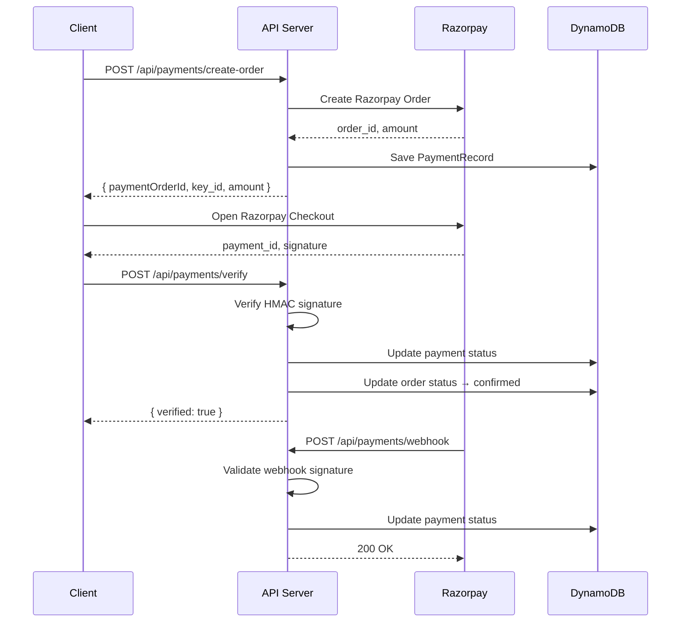

# Payment Flow

## Overview

UrgentCart integrates with Razorpay for payment processing, using a provider abstraction pattern that allows seamless switching between a mock provider (local development) and the real Razorpay provider (production).

## Setup Instructions

### Local Development (Default)

No setup required. By default, `PAYMENT_MODE=local` uses the mock provider which simulates successful payments with a 1-second delay.

### Razorpay Production Setup

1. Create a Razorpay account at https://dashboard.razorpay.com
2. Generate API keys from Settings → API Keys
3. Set up a webhook endpoint in Settings → Webhooks:
   - URL: `https://your-domain.com/api/payments/webhook`
   - Events: `payment.authorized`, `payment.captured`, `payment.failed`
4. Copy the webhook secret

### Environment Variables

```env
# Payment Configuration
PAYMENT_MODE=local                    # "local" (mock) or "razorpay" (production)
RAZORPAY_KEY_ID=                      # Razorpay Key ID (starts with rzp_)
RAZORPAY_KEY_SECRET=                  # Razorpay Key Secret
RAZORPAY_WEBHOOK_SECRET=              # Webhook secret from Razorpay dashboard
NEXT_PUBLIC_RAZORPAY_KEY_ID=          # Public key for client-side (same as RAZORPAY_KEY_ID)
```

## API Endpoints

| Method | Endpoint | Auth | Description |
|--------|----------|------|-------------|
| POST | `/api/payments/create-order` | Required | Creates a payment order |
| POST | `/api/payments/verify` | Required | Verifies payment signature |
| POST | `/api/payments/webhook` | None (Razorpay) | Handles Razorpay webhooks |
| GET | `/api/payments/status/[orderId]` | Required | Gets payment status |

## Payment Flow Sequence



## Provider Architecture

The payment system follows the same provider abstraction pattern used for AI:

```
src/services/payments/
├── types.ts           # PaymentProvider interface + types
├── razorpayProvider.ts # Real Razorpay integration
├── mockProvider.ts    # Local development mock
├── paymentService.ts  # Higher-level orchestration
└── index.ts           # Factory (getPaymentProvider)
```

### Mock Provider Behavior

- `createOrder`: Returns mock order ID (`pay_mock_{timestamp}`), simulates 1s delay
- `verifyPayment`: Always returns `{ verified: true }`
- `validateWebhook`: Always returns `true`

### Razorpay Provider

- `createOrder`: Calls `razorpay.orders.create()` with amount in paise
- `verifyPayment`: Validates HMAC SHA256 signature (`order_id|payment_id` signed with key_secret)
- `validateWebhook`: Validates webhook body signature using webhook secret

## Security

- Payment verification uses HMAC SHA256 signatures
- Webhook endpoint validates Razorpay signature before processing
- All user-facing endpoints require authentication
- Order ownership is verified before creating payment orders
- Amount is always stored in paise (INR × 100) to avoid floating-point issues

## DynamoDB Table Schema (Payments)

| Key | Format | Description |
|-----|--------|-------------|
| PK | `PAYMENT#{paymentOrderId}` | Partition key |
| SK | `ORDER#{orderId}` | Sort key |
| GSI1PK | `ORDER#{orderId}` | For lookup by orderId |
| GSI1SK | `PAYMENT#{paymentOrderId}` | GSI sort key |
